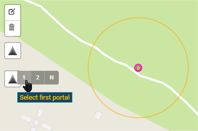
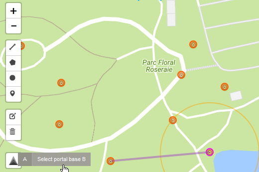
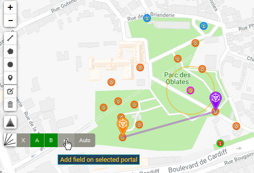
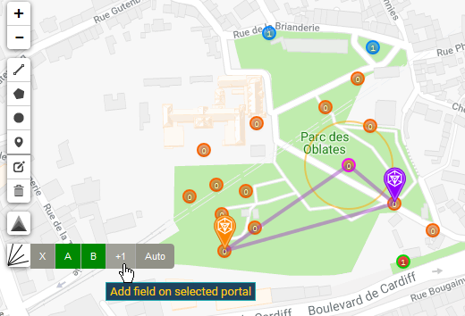
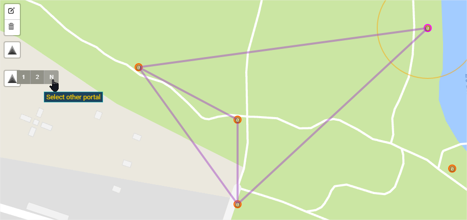
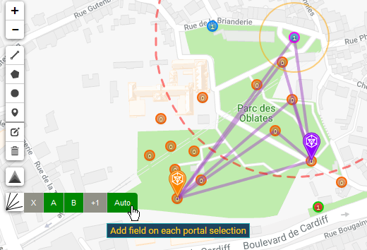
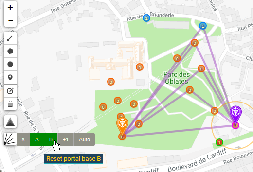
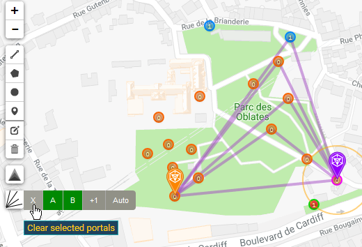

<ol>
    <li>
        <a href="https://iitc.me" target="_blank">Installer IITC</a>
    </li>
    <li>
        <a href="https://static.iitc.me/build/release/plugins/draw-tools.user.js">Installer le plugin Draw tools</a>
    </li
    <li>
        <a href="https://kewwwa.github.io/iitc-plugin-multidraw/plugins/multi-draw.user.js">Installer le plugin Multi draw</a>
    </li>
    <li>
        Vérifier que le plugin est bien activé dans la catégorie "Layer"
    </li>
    <li>
        
Sélectionner le premier portail et cliquer sur "A"

        
    </li>
    <li>
        
Sélectionner le second portail et cliquer sur "B"

        
    </li>
    <li>
        
Sélectionner un autre portail et cliquer sur "+1"

        
    </li>
    <li>
        
Cliquer à nouveau sur "+1" pour effacer

        
    </li>
    <li>
        
Continuer votre plan en sélectionnant d'autres portails et en cliquant sur "+1"

        
    </li>
    <li>
        
Cliquer sur "Auto" pour activer/désactiver l'ajout automatique au plan à la sélection d'un portail

        
    </li
    <li>
        
Cliquer sur "A" ou "B" pour modifier la base.

        
    </li>
    <li>
        
Cliquer sur "X" pour effacer la sélection des portails de base.

        
    </li>
</ol>